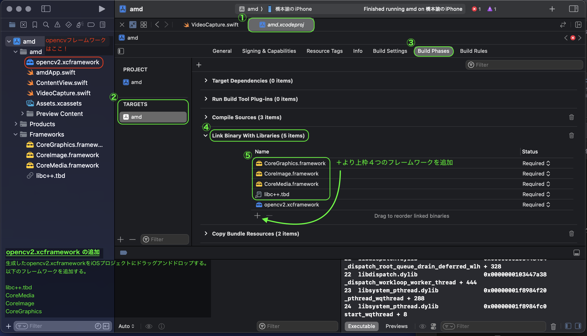

# Xcode(SwiftUI) で OpenCV を動かす:

[参考: opencv2.xcframework を自分でビルドする](https://dev.classmethod.jp/articles/build-opencv2-xcframework-manually/)

## framework:

### 作成した xcframework を以下へ配置:



### その他の framework の追加:

1. libc++.tbd の追加
    - Xcodeのプロジェクトナビゲータで、プロジェクト名をクリックします。
    - ターゲットの設定画面が表示されるので、左側の「Build Phases」を選択します。
    - 「Link Binary With Libraries」を展開します。
    - 「+」ボタンをクリックします。
    - リストから「libc++.tbd」を検索し、選択して「Add」をクリックします。
2. CoreMedia, CoreImage, CoreGraphics フレームワークの追加
    - 同様に「Build Phases」の「Link Binary With Libraries」を展開します。
    - 「+」ボタンをクリックします。
    - 各フレームワークを個別に検索します。  
        （例：CoreMedia.framework, CoreImage.framework, CoreGraphics.framework）。
    - 各フレームワークを選択して「Add」をクリックします。

## Other Linker Flags:


1. プロジェクト設定に移動:
    - 左側のプロジェクトナビゲーターで、プロジェクトの名前をクリックします。
    - プロジェクトとターゲットの設定画面が表示されます。
2. ターゲットを選択:
    - 画面上部のTARGETSセクションで、ターゲットを選択します（通常、プロジェクト名と同じ名前のターゲットです）。

3. Build Settingsタブを選択:
    - 上部のタブからBuild Settingsを選択します。

4. 全ての設定を表示:
    - BasicとAllという切り替えボタンがあれば、Allを選択して全ての設定を表示します。
    - また、スコープをCombinedまたはLevelsのいずれかに設定します。
5. Other Linker Flagsを検索:
    - 検索バーにOther Linker Flagsと入力し、設定項目を絞り込みます。
    - LinkingセクションにOther Linker Flagsが表示されます。

6. Other Linker Flagsを編集:
    - Other Linker Flagsの項目をダブルクリックします。
    - 表示されるウィンドウで、+ボタンをクリックし、新しいフラグを追加するフィールドを表示します。
    - フィールドに `-all_load` と入力します。

### キャッシュのクリア (必要な場合のみ):

```bash
/Users/{UseName}/Library/Developer/Xcode/DerivedData
```

- キャッシュをリセットしたい時はこの中身を消す。
- 但し依存関係なくなるので他のものまで動かなくなる可能性あり!


